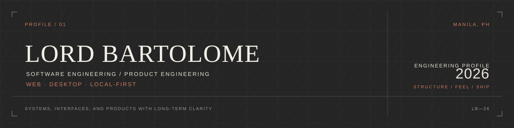
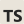
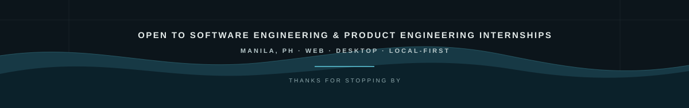

I build thoughtful web and desktop products with clean interfaces, practical architecture, and end-to-end product implementation.

  <a href="https://llbartolome-portfolio.vercel.app/"><strong>01 / PORTFOLIO ↗</strong></a>
  &nbsp;&nbsp;·&nbsp;&nbsp;
  <a href="https://llbartolome-portfolio.vercel.app/work.html"><strong>02 / WORK INDEX ↗</strong></a>

---

## 01 / CURRENTLY

- BS Information Technology student in the Philippines
- Building product-focused web and desktop applications
- Open to **Software Engineering, Frontend, Full-Stack, and Product Engineering internships**
- Interested in local-first software, offline-capable apps, and polished product experiences

---

## 02 / CORE STACK

**Core**

<table>
  <tr>
    <td align="center"> <code>TypeScript</code></td>
    <td align="center"> <code>React</code></td>
    <td align="center"> <code>Next.js</code></td>
    <td align="center"> <code>Node.js</code></td>
    <td align="center"> <code>PostgreSQL</code></td>
    <td align="center"> <code>Supabase</code></td>
  </tr>
</table>

**Product / Data / Tooling**

<table>
  <tr>
    <td align="center"> <code>SQLite</code></td>
    <td align="center"><code>IndexedDB</code></td>
    <td align="center"><code>Zustand</code></td>
    <td align="center"> <code>TanStack Query</code></td>
    <td align="center"> <code>Git</code></td>
    <td align="center"> <code>GitHub</code></td>
    <td align="center"> <code>Vercel</code></td>
  </tr>
</table>

**Beyond Core**

<table>
  <tr>
    <td align="center"> <code>Rust</code></td>
    <td align="center"> <code>Tauri</code></td>
    <td align="center"> <code>Flutter</code></td>
    <td align="center"> <code>C++</code></td>
    <td align="center"> <code>OpenGL</code></td>
  </tr>
</table>

---

## 03 / SELECTED WORK

### Moneda — Personal Finance Product 🔒

Offline-capable finance application for tracking transactions, transfers, budgets, savings, and debts with domain-aware money movement.

`Next.js` `TypeScript` `Supabase` `PostgreSQL` `IndexedDB`

Private source · [Case Study ↗](https://llbartolome-portfolio.vercel.app/projects/moneda.html)

---

### MemoryLane — Local-First Desktop Timeline

A Tauri/Rust desktop application for capturing and browsing a private, locally stored visual activity timeline.

`Tauri` `Rust` `React` `SQLite`

Private product · [Repository ↗](https://github.com/imainzed5/memorylane) · [Case Study ↗](https://llbartolome-portfolio.vercel.app/projects/memorylane.html)

---

### Vince — Collaborative Project Workspace

A collaborative workspace concept for project tracking, Kanban workflows, notes, team communication, milestones, and real-time interactions.

`React` `TypeScript` `Supabase` `Zustand` `dnd-kit`

Concept · [Repository ↗](https://github.com/imainzed5/Vince) · [Browse Work ↗](https://llbartolome-portfolio.vercel.app/work.html)

---

### Sahagun Dental Care — Client Website

A production website for a local dental clinic in Caloocan, focused on clear service discovery, trust, and straightforward inquiries.

`HTML` `CSS` `JavaScript`

Client project · [Repository ↗](https://github.com/imainzed5/sahagun-dental-care) · [Case Study ↗](https://llbartolome-portfolio.vercel.app/projects/sahagun-dental-care.html)

> Some larger product repositories are intentionally private. The portfolio contains the broader product and case-study view.

---

## 04 / HOW I BUILD

**Understand the workflow → define behavior and data → design the interface → implement → refine.**

I care about coherent domain rules, offline behavior, state boundaries, interaction details, and choosing the simplest architecture appropriate to the problem.

---

## 05 / ELSEWHERE

[Portfolio ↗](https://llbartolome-portfolio.vercel.app/) · [Work Index ↗](https://llbartolome-portfolio.vercel.app/work.html)

